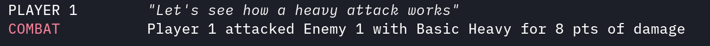
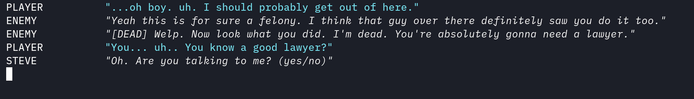

# RPG ✨🕹️

[](https://goreportcard.com/report/github.com/brittonhayes/rpg)
[](https://pkg.go.dev/github.com/brittonhayes/rpg)

> Create text-based role-playing games with Go

<image src="./assets/logo.png" width=500/>

## Installation 📥

```shell
go get github.com/brittonhayes/rpg
```

## Examples

Check the [_examples](./_examples) directory for examples of how to use the library.

## Characters 👥

Use `rpg/character` to create players, NPCs, and enemies in your game. Keep it simple or customize to your heart's content with character builder options.

### Create a player

Create a simple character with some basic defaults.

```go
player := character.New(
    character.WithName("Player 1"),
    character.WithRank(1),
)
```

### Customize your character

Get a little more creative and build out the character how _you_ want.

```go
player := character.New(
    character.WithName("Player 1"),
    character.IsPlayer(),
    character.WithRank(1),
    character.WithHealth(stat.Full),
    character.WithAttacks(
        character.NewAttack("Smack", character.LightAttack, 8.00),
        character.NewAttack("Stomp", character.HeavyAttack, 20.00),
    ),
    character.WithCustomStats(
        map[string]*character.Stat{
            "Intelligence": character.NewStat(stat.Half),
            "Charm":        character.NewStat(stat.Low),
        },
    ),
)
```

## Combat ⚔️

Make players and NPCs engage in combat with the `player.Attack()` method. Attacks will take into account health, armor, and attack damage.

### Example Code

```go
log := logger.NewLogger(os.Stderr)

// Create a player
player := character.New(
    character.WithName("Player 1"),
)

// Create an enemy
enemy := character.New(
    character.WithName("Enemy 1"),
    character.WithHealth(stat.Low),
    character.WithArmor(stat.Half),
)

// Attack the enemy
dialogue.Say(player, "Let's see how a heavy attack works")
player.Attack(enemy, player.Attacks.Heavy)

// Log the attack
log.Attack(player.Name, enemy.Name, player.Attacks.Heavy)
```

### Preview



## Dialogue 💬

Create conversations between players and handle their answers with the a custom answer handler function.

### Example Code

```go
player := character.New(
    character.WithName("Player"),
    character.IsPlayer(),
    character.WithRank(5),
    character.WithHealth(stat.Full),
)

enemy := character.New(
    character.WithName("Enemy"),
    character.WithRank(1),
    character.WithHealth(stat.Half),
)

npc := character.New(
    character.WithName("Steve"),
)

// Speak as a player
dialogue.Say(player, "Hey there! I'm the main character.")

// Speak as an NPC
dialogue.Say(enemy, "I'm an enemy. You can tell by my different output color.")

// Speak as an NPC that died in combat. This will be prepended with "[DEAD]".
enemy.Health = 0.00
dialogue.Say(enemy, "I've been defeated")

// Ask a question to the player and handle their answer
// with a custom function
dialogue.Ask(npc, "Did you just kill that guy..?", func(answer string) error {
    dialogue.Say(npc, fmt.Sprintf("I don't know boss, but I feel like %q won't hold up in court.", answer))
    return nil
})
```

### Preview



